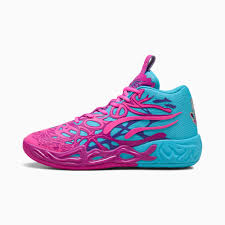
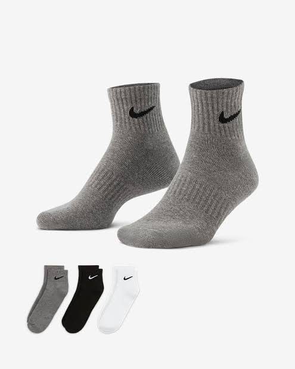

<!DOCTYPE html>
<html lang="en">
<head>
    <meta charset="UTF-8">
    <meta name="viewport" content="width=device-width, initial-scale=1.0">
    <title>Shopee</title>
    
</head>
<body>
    <!-- Header Section -->
    

        <h1>JERICK RIVERA EXAM</h1>
    

    
    <!-- Navigation Section -->
    

        <ul>
            <li><a href="#">Home</a></li>
            <li><a href="#">Categories</a></li>
            <li><a href="#">Deals</a></li>
            <li><a href="#">Cart</a></li>
        </ul>
    

    
    <!-- Main Content Section -->
    

        

            <h2>Products</h2>
            

                
                
NBA BASKETBALL SHOES

                
₱359

                <button>Add to Cart</button>
            

            
            

                
                
ORIGINAL MOLTEN

                
₱599

                <button>Add to Cart</button>
            

                        

                
                
NIKE SOCKS

                
₱369

                <button>Add to Cart</button>
            

        

        
        <!-- Side Content Section -->
        

            <h2>Categories</h2>
            <ul>
                <li>Electronics</li>
                <li>Fashion</li>
                <li>Home & Garden</li>
            </ul>
        

    

    
    <!-- Footer Section -->
    

        
&copy; JERICK RIVERA

    

</body>
</html>
